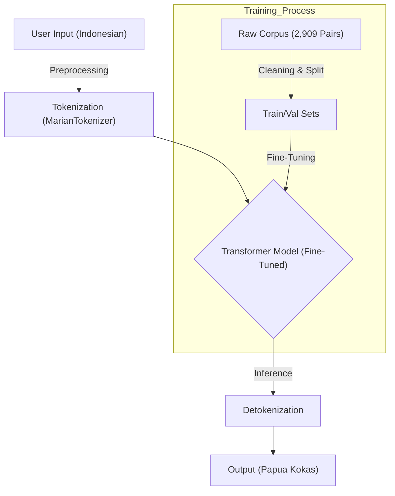

# Revitalizing the Endangered Papua Kokas Language: A Low-Resource NMT Approach using Transformers

**Abstract**—The preservation of indigenous languages is a critical challenge in the digital age, particularly for under-resourced languages like Papua Kokas, spoken in the Fakfak regency of West Papua, Indonesia. This paper presents a Neural Machine Translation (NMT) system designed to facilitate the revitalization of the Papua Kokas language by enabling automatic translation from Indonesian. Utilizing a low-resource NMT approach, we employ Transfer Learning with a Transformer-based architecture. Specifically, we fine-tune the MarianMT model, originally pre-trained on a larger Indonesian-English corpus, using a manually curated dataset of 2,909 Indonesian-Kokas sentence pairs. Our experiments demonstrate the feasibility of this approach, achieving a peak BLEU score of **46.42**, indicating a high degree of translation quality despite limited data availability. The system was further deployed into a web-based application to enable real-time translation, providing a scalable framework for digital preservation of endangered languages.

**Keywords**—Neural Machine Translation, Low-Resource Languages, Transformers, MarianMT, Papua Kokas, Language Preservation.

## I. INTRODUCTION

Indonesia is a linguistically diverse nation with over 718 distinct languages, 428 of which are spoken in the Papua region [1]. However, a significant number of these languages, including Papua Kokas (also known as Sekar), are currently endangered due to the declining number of native speakers and the dominance of the national language, Indonesian (*Bahasa Indonesia*). Revitalizing such languages requires not only documentation but also the development of digital tools that can bridge the gap between the younger generation and their ancestral tongue.

Machine Translation (MT) offers a powerful solution for language revitalization. However, modern Neural Machine Translation (NMT) models, such as the Transformer architecture proposed by Vaswani et al. [2], typically require massive parallel corpora to achieve fluency. For Papua Kokas, where digitized text is scarce, training an NMT model from scratch is infeasible.

To address this, this study adopts a **Transfer Learning** approach. We leverage a pre-trained Transformer model (MarianMT) [3], specifically the `opus-mt-id-en` model trained by Helsinki-NLP. Although the pre-trained model targets English, its encoder has learned robust representations of Indonesian syntax and semantics. By fine-tuning this model on a small, high-quality corpus of 2,909 Indonesian-Kokas pairs, we successfully transfer this linguistic knowledge to the new target language.

## II. RELATED WORK

### A. NMT in Low-Resource Indonesian Contexts
Research on NMT for local Indonesian languages has gained traction. Abidin [4] explored NMT for Lampung-Indonesian using Recurrent Neural Networks (RNN), highlighting the importance of OOV (Out-Of-Vocabulary) handling. Fauziyah et al. [5] implemented an RNN-based Encoder-Decoder for Indonesian-Sundanese translation. More recently, Meilinda et al. [6] utilized a Pivot Language strategy for Melayu Pontianak to Bugis translation using Transformers.

Unlike previous RNN-based approaches which may struggle with long-range dependencies, this study employs the **Transformer** architecture, which relies entirely on self-attention mechanisms [2]. Furthermore, instead of using pivot languages, we utilize direct Transfer Learning from a high-resource parent model, a technique shown to be effective for extremely low-resource settings [7].

### B. Transformer Applications in Text Processing
Transformers have become the state-of-the-art in various NLP tasks in Indonesia. Rendragraha et al. [8] used BERT for offensive language detection, while Purnama & Utami [9] applied the T5 model for text summarization. Our work extends the application of Transformers (specifically MarianMT) to the domain of indigenous language preservation in West Papua.

## III. METHODOLOGY

### A. System Architecture
The proposed system follows a standard NMT pipeline adapted for transfer learning. The workflow encompasses data collection, preprocessing, model fine-tuning, and deployment.

### B. Data Collection and Preparation
The dataset was constructed through field interviews with native speakers in the Kokas District. It consists of parallel sentences covering daily conversation domains.

**TABLE I. DATASET STATISTICS**

| Parameter | Value |
| :--- | :--- |
| **Source Language** | Indonesian |
| **Target Language** | Papua Kokas |
| **Total Sentence Pairs** | 2,909 |
| **Training Split (90%)** | 2,617 |
| **Validation Split (10%)** | 291 |
| **Format** | Parallel CSV |

### C. Preprocessing and Tokenization
We utilized the `MarianTokenizer` associated with the pre-trained model. Preprocessing steps included:
1.  **Case Folding**: Converting all text to lowercase to reduce vocabulary size.
2.  **Cleaning**: Removal of non-standard punctuation and whitespace.
3.  **Subword Tokenization**: Breaking words into subword units (e.g., *SentencePiece*) to handle agglutinative morphology and rare words effectively.

### D. Model Configuration
The model is based on the MarianMT architecture, a efficient C++ implementation of Transformers. We fine-tuned the `Helsinki-NLP/opus-mt-id-en` model. The training parameters were optimized for the small dataset size to prevent overfitting.

**TABLE II. HYPERPARAMETERS**

| Hyperparameter | Value |
| :--- | :--- |
| **Architecture** | Encoder-Decoder Transformer |
| **Optimizer** | AdamW |
| **Learning Rate** | $2 \times 10^{-5}$ |
| **Batch Size** | 16 |
| **Epochs** | 100 |
| **Weight Decay** | 0.01 |
| **Warmup Steps** | 500 |
| **Loss Function** | Cross-Entropy |

The loss function $\mathcal{L}$ minimizes the negative log-likelihood of the target tokens $y_t$ given the input $X$ and previous tokens $y_{1:t-1}$:

$$ 
\mathcal{L} = - \sum_{t=1}^{T} \log P(y_t \mid y_{1:t-1}, X; \theta) 
$$ 

## IV. EXPERIMENTS AND RESULTS

### A. Experimental Setup
The experiments were conducted on a workstation equipped with an AMD Ryzen 5 4500U processor and 20GB RAM, using PyTorch and the Hugging Face Transformers library.

### B. Quantitative Results (BLEU Score)
We evaluated the model using the **BLEU (Bilingual Evaluation Understudy)** metric. The model performance was monitored over 100 epochs.

**TABLE III. EVALUATION RESULTS (SELECTED EPOCHS)**

| Epoch | Eval Loss | BLEU Score | Status |
| :---: | :---: | :---: | :--- |
| 1 | 1.437 | 5.61 | Underfitting |
| 10 | 0.867 | 23.18 | Improving |
| 20 | 0.644 | 32.60 | Improving |
| 30 | 0.537 | 39.08 | Converging |
| **45** | **0.574** | **46.42** | **Best Performance** |
| 50 | 0.586 | 45.56 | Stable |
| 100 | 0.633 | 45.50 | Final |

The model achieved its peak performance at **Epoch 45** with a BLEU score of **46.42**. As shown in the training logs, the BLEU score increased rapidly in the first 30 epochs and stabilized around 45-46. The Evaluation Loss remained low (~0.57), suggesting that the model did not suffer from significant overfitting despite the small dataset size.

### C. Qualitative Analysis
The system was deployed as a web application using the Django framework.
*   **Input**: "*bagaimana kabarmu*" (Indonesian)
*   **Predicted Output**: "*okabar akape*" (Papua Kokas)
*   **Reference**: "*okabar akape*"

The model demonstrates the ability to translate common phrases accurately. The use of subword tokenization allowed the model to handle morphological variations inherent in the Kokas language.

## V. CONCLUSION

This research successfully demonstrates the viability of using Transfer Learning with Transformer architectures for extremely low-resource languages. With a dataset of only 2,909 sentences, the fine-tuned MarianMT model achieved a BLEU score of **46.42**. This approach provides a practical roadmap for revitalizing Papua Kokas and other endangered languages in Indonesia. Future work will focus on expanding the corpus and exploring additional evaluation metrics such as TER and METEOR.

## REFERENCES

[1] Badan Bahasa Kemendikbud, "Data Bahasa Daerah di Indonesia," 2024.
[2] A. Vaswani et al., "Attention is all you need," in *Adv. Neural Inf. Process. Syst.*, 2017, pp. 5998–6008.
[3] M. Junczys-Dowmunt et al., "Marian: Fast neural machine translation in C++," in *Proc. ACL 2018 System Demonstrations*, 2018, pp. 116–121.
[4] Z. Abidin, "Penerapan Neural Machine Translation untuk Eksperimen Penerjemahan secara Otomatis pada Bahasa Lampung – Indonesia," *Prosiding Seminar Nasional Metode Kuantitatif*, pp. 53–68, 2017.
[5] Y. Fauziyah, R. Ilyas, and F. Kasyidi, "Mesin Penterjemah Bahasa Indonesia-Bahasa Sunda Menggunakan Recurrent Neural Networks," *Jurnal Teknoinfo*, vol. 16, no. 2, p. 313, 2022.
[6] A. D. Meilinda, H. Sujaini, and N. Safriadi, "Pivot Language Bahasa Melayu Pontianak ke Bahasa Bugis Menggunakan Neural Machine Translation," *Jurnal Sistem dan Teknologi Informasi*, vol. 9, no. 2, pp. 234–241, 2023.
[7] B. Zoph, D. Yuret, and J. May, "Transfer learning for low-resource neural machine translation," in *Proc. EMNLP*, 2016, pp. 1568–1575.
[8] A. D. Rendragraha, M. A. Bijaksana, and A. Romadhony, "Pendekatan Metode Transformers untuk Deteksi Bahasa Kasar dalam Komentar Berita Online Indonesia," *E-Proceeding of Engineering*, vol. 8, no. 2, pp. 3385–3395, 2021.
[9] I. N. Purnama and N. N. W. Utami, "Implementasi Peringkas Dokumen Berbahasa Indonesia Menggunakan Metode Text To Text Transfer Transformer (T5)," *Jurnal Teknologi Informasi Dan Komputer*, vol. 9, no. 4, pp. 381–391, 2023.